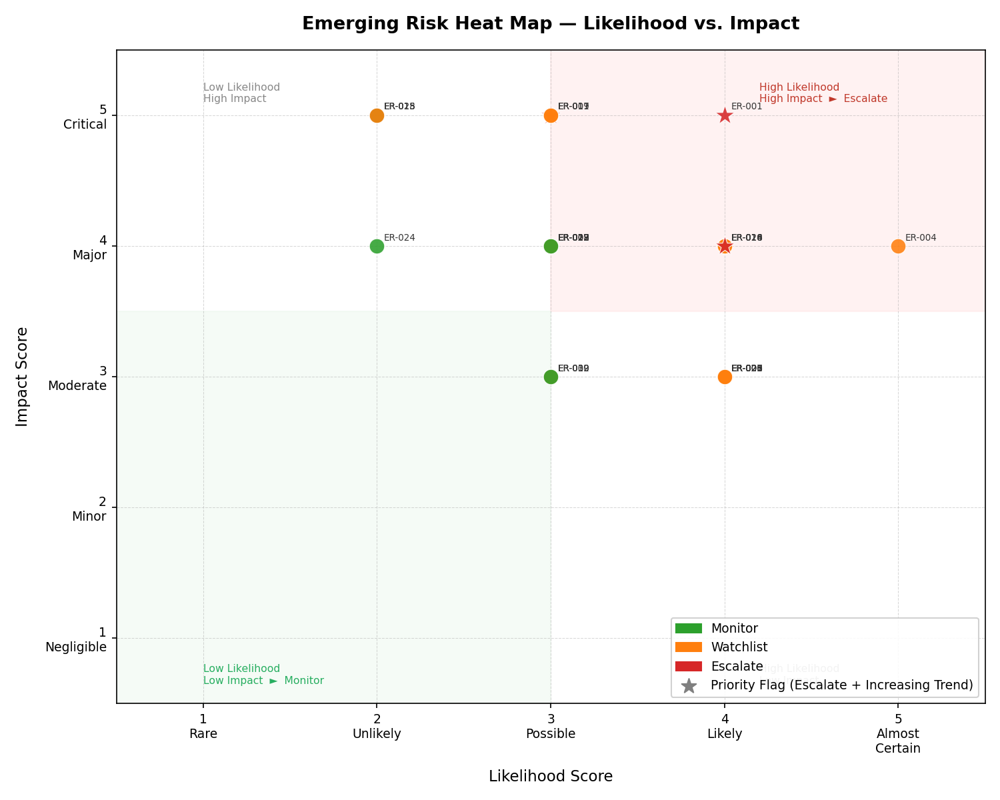

# Emerging Risk Identification and Monitoring Framework

> A Python project that simulates how a bank's strategy and emerging-risk
> team identifies, scores, triages, and reports on new threats — end to end.

---

## Project Snapshot

| | |
|---|---|
| **What it is** | A working emerging-risk pipeline: build a risk register → score it → triage it → produce board-ready reports and a heat map. |
| **Domain** | Strategy & emerging risk at a large financial institution (banking / insurance / asset management). |
| **Dataset** | 30 synthetic emerging risks across 11 categories, 15 fields each — hard-coded and stable, so every number is explainable. |
| **Stack** | Python · pandas · matplotlib · numpy. No database, no framework — runs with one command. |
| **Run it** | `pip install -r requirements.txt && python main.py` |
| **Output** | 4 CSV reports + 1 heat map chart, written to `output/`. |

---

## Key Outputs

| File | What it is | Who reads it |
|---|---|---|
| `output/risk_register.csv` | Full 30-row register with all four derived scores | Risk team (master record) |
| `output/executive_summary.csv` | Escalate + Watchlist items, sorted for attention | Risk Committee / board |
| `output/top_5_risks.csv` | The five highest residual-risk items | Senior leadership |
| `output/risk_counts_by_category.csv` | Status and average score rolled up by category | Risk team / CRO |
| `output/risk_heatmap.png` | Likelihood × Impact heat map | Committee presentations |

---

## Dashboard Preview

The headline deliverable is a Likelihood × Impact heat map — the standard
one-glance view used in risk committees. Colour shows triage status, and a
star marks priority-flagged items. The top-right quadrant is the danger zone.



---

## What Is Emerging Risk?

Emerging risks are threats that are new, fast-moving, or not yet fully
captured by traditional risk frameworks. Unlike well-understood risks such as
credit default or interest-rate moves — which banks have managed for decades —
they call for a different discipline: early identification, systematic scoring,
and continuous monitoring rather than purely quantitative modelling.

Every major bank, insurer, and asset manager has a team that does this work.
Their job is to look around corners — to spot a geopolitical shift, a
technology threat, or a regulatory change before it becomes a crisis — and to
make sure the right people are paying attention in time to act.

This project replicates that workflow: build a risk register, score and triage
it, and produce the reports and visuals that land in front of senior leadership.

---

## How to Run

```bash
pip install -r requirements.txt
python main.py
```

All output files are written to `output/`.

---

## How the Scoring Works

The logic is deliberately simple and transparent — easy to explain to a
non-technical stakeholder, and easy to defend in an interview.

### Inherent Risk — raw exposure before controls
> `(likelihood × impact) + velocity` — scale 3 to 30

- **Likelihood × Impact** captures severity: how probable × how damaging (1–25).
- **Velocity** is added as an urgency premium — fast-moving threats leave less
  time for controls to activate, so they score higher (adds 1–5).

Why *add* velocity instead of multiplying? Multiplying would unfairly punish
slow-moving but severe risks (climate, Basel IV). Adding keeps slow-burn
threats visible while still rewarding fast-mover urgency.

> **Ransomware** (L=4, I=5, V=5) → (4×5)+5 = **25**
> **Basel IV** (L=5, I=4, V=2) → (5×4)+2 = **22** — still high despite slow velocity

### Residual Risk — what remains after controls
> `inherent_risk × (1 − control_effectiveness)`

`control_effectiveness` is a discount factor between 0 and 1: `0.60` means
controls absorb 60% of the exposure, leaving 40% live.

> **Ransomware**: 25 × (1 − 0.55) = **11.25 → Escalate**

### Risk Status — the triage label
Thresholds are calibrated to this portfolio's residual range (~3–14).

| Status | Residual | Action |
|---|---|---|
| **Escalate** | ≥ 11 | Immediate senior-leadership attention; mitigation plan required |
| **Watchlist** | ≥ 7 | Review monthly; escalation criteria defined |
| **Monitor** | < 7 | Standard quarterly review |

### Priority Flag — the "act now" marker
Flags items that are **both** high-exposure **and** getting worse:

- `residual_risk ≥ 11` (Escalate tier), **and**
- `trend_direction == "Increasing"`

These are the two-bad-signals items a Chief Risk Officer puts at the top of a
board pack: high despite controls, and trending the wrong way.

### Regulatory Attention — a sort, not a score
`regulatory_attention` (High / Medium / Low) reflects external regulator
pressure, not intrinsic severity, so it doesn't change the numeric score.
It's used as a **secondary sort** in the executive summary: within each tier,
items under active scrutiny surface first.

---

## The Data

A synthetic dataset of **30 emerging risks**, each with 15 fields, built to
reflect what a large bank's strategy team would actually monitor.

| Field | Description |
|---|---|
| `risk_id` | Unique identifier (ER-001 to ER-030) |
| `risk_name` | Short name for the risk |
| `risk_category` | One of 11 categories (below) |
| `business_unit` | The part of the firm most exposed |
| `description` | Plain-language explanation of the threat |
| `likelihood_score` | How probable is the event? (1–5) |
| `impact_score` | How severe would the damage be? (1–5) |
| `velocity_score` | How fast could it escalate once triggered? (1–5) |
| `control_effectiveness` | How well existing controls reduce exposure (0.0–1.0) |
| `regulatory_attention` | Regulator focus: High / Medium / Low |
| `trend_direction` | Increasing / Stable / Decreasing |
| `owner` | The senior executive accountable |
| `mitigation_status` | Not Started / In Progress / Completed |
| `last_review_date` | Date of most recent formal review |
| `next_review_date` | Scheduled next review |

**Categories covered:**

| Category | Example Risk |
|---|---|
| Cybersecurity | Ransomware attack on core banking systems |
| Regulatory / Compliance | Basel IV capital requirements |
| Climate / ESG | Physical climate risk in the mortgage portfolio |
| Geopolitical | US–China trade war escalation |
| Technology / AI | GenAI adoption without a governance framework |
| Market Risk | Commercial real estate valuation collapse |
| Operational Risk | Critical cloud provider outage |
| Credit Risk | Consumer credit deterioration from stagflation |
| Third-Party / Vendor | Critical payment-rail vendor insolvency |
| Strategic Risk | Fintech disintermediation of retail deposits |
| Conduct / Legal | Mis-selling risk in structured products |

---

## What the Outputs Show

- **`risk_register.csv`** — the complete 30-row register with every field and
  all four derived scores. The master document the risk team maintains.
- **`executive_summary.csv`** — Escalate and Watchlist items only, sorted by
  residual risk, then by regulatory attention within each tier. This is what
  goes to a Risk Committee — the items needing attention, not the full register.
- **`top_5_risks.csv`** — the five highest residual scores: a one-page view of
  the firm's most pressing exposures.
- **`risk_counts_by_category.csv`** — per category: total risks, count by
  status, average residual score, and priority-flagged items. Shows which
  *areas* of the firm carry the most concentrated risk.
- **`risk_heatmap.png`** — the Likelihood × Impact chart shown above.
  x = Likelihood (1 Rare → 5 Almost Certain), y = Impact (1 Negligible →
  5 Critical), colour = status, star = priority flag.

---

## Project Structure

```
/
├── README.md               ← you are here
├── requirements.txt        ← Python dependencies
├── main.py                 ← runs the full pipeline
├── data/
│   └── risk_register_raw.csv    ← unscored input dataset (refreshed on run)
├── output/
│   ├── risk_register.csv        ← full 30-row scored register
│   ├── executive_summary.csv    ← Escalate + Watchlist items for leadership
│   ├── top_5_risks.csv          ← five highest residual-risk items
│   ├── risk_counts_by_category.csv  ← aggregated view by category
│   └── risk_heatmap.png         ← likelihood × impact heat map
└── src/
    ├── data_generator.py   ← builds the synthetic risk register (30 risks)
    ├── scoring.py          ← inherent risk, residual risk, status, priority flag
    └── reporting.py        ← generates all CSVs and the heat map
```

---

## Why This Matters for Risk Roles

The pipeline mirrors the real workflow of an emerging-risk team:

| Step | Real-world activity | In this project |
|---|---|---|
| **Identify** | Horizon scanning, regulatory bulletins, internal nominations | 30 risks across 11 categories |
| **Score** | Committee scores likelihood, impact, velocity, controls | `scoring.py` |
| **Triage** | Sort risks into governance action tiers | `risk_status` |
| **Prioritise** | Flag worsening high-exposure items | `priority_flag` |
| **Report** | Board packs, committee updates, roll-ups | Summary, top-5, category counts |
| **Visualise** | Heat maps for committee presentations | `risk_heatmap.png` |

**A few talking points it sets up:**

- *Inherent vs. residual* — inherent risk is how bad a threat is if you do
  nothing; residual is what's left after controls. That gap is where risk
  management actually lives.
- *Velocity* — built into the inherent score so fast-movers get urgency credit
  without penalising slow-burn existential risks.
- *The priority flag* — catches the intersection of high residual exposure and
  a worsening trend, which is exactly what a CRO escalates first.

---

## Limitations and Future Improvements

This is a focused portfolio project, not a production system. Known limitations
and natural next steps:

- **Synthetic data.** The 30 risks are hand-built for clarity, not pulled from
  live feeds. A production version would ingest real horizon-scanning sources.
- **Static scoring weights.** Thresholds and the velocity premium are calibrated
  to this dataset. A real framework would tune them against historical outcomes.
- **No trend history.** `trend_direction` is a single label; tracking residual
  scores over time would enable proper trajectory analysis.
- **CSV outputs.** Reports are flat files. A dashboard (Streamlit / Power BI)
  would make the register interactive for committee use.
- **Single-run snapshot.** There's no scenario or stress-testing layer — a
  useful extension for modelling how shocks shift the portfolio.
